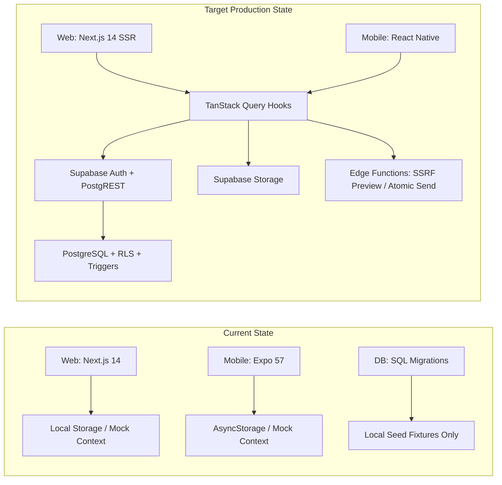

# LINKIAC — Engineering Implementation & Handoff Plan

**Document Version:** 1.0  
**Target Release:** Production Baseline v1.0  
**Status:** Approved for Engineering Execution  
**Target Location:** Monorepo Root (`/IMPLEMENTATION_PLAN.md`)  
**Audience:** Full-Stack Engineers, Mobile Engineers, QA, Security & DevOps Leads  
**Reference Documents:**
- Product Requirements Definition ([Linkiac_Product_Requirements_Definition_v1.0.docx](file:///f:/App%20Development/LinkIac/Linkiac_Product_Requirements_Definition_v1.0.docx))
- Engineering Specification ([engineering-spec.md](file:///f:/App%20Development/LinkIac/engineering-spec.md))
- Engineering Best Practices Playbook ([Linkiac_Engineering_Best_Practices_v1.0.docx](file:///f:/App%20Development/LinkIac/Linkiac_Engineering_Best_Practices_v1.0.docx))

---

## 1. Executive Summary & Objective

This document provides a comprehensive, step-by-step engineering implementation plan to transition Linkiac from its current state (a functional prototype with localized mock state) into a hardened, production-grade universal link-saving and sharing platform.

### Current State vs. Target State



### Priority Schema

Per product leadership direction, priorities are classified as follows:
- **P1 (Important / Mandatory for Baseline Release):** Security boundaries, database & auth integration, data integrity, core user journeys, missing mobile/web parity features, error handling, and CI gates.
- **P2 (Secondary / Enhancement):** Advanced animation polish, non-blocking telemetry enhancements, and offline sync optimizations.

---

## 2. Phase 1: Architectural Alignment & Monorepo Hygiene (P1)

### 1.1 Mobile Strategy Decision & Clean-up (P1)
The PRD (§3, §12) originally specified a native WebView shell (Capacitor), while the engineering spec and current codebase built a standalone Expo / React Native application in `apps/mobile/`.

* **Task 1.1.1 — Formalize React Native (Expo) Architecture:** Confirm the standalone React Native Expo architecture as the official mobile product strategy.
* **Task 1.1.2 — Purge Dead Capacitor Config:** Remove `@capacitor/*` dependencies, `capacitor.config.ts`, and `cap:*` npm scripts from `apps/web/package.json` to eliminate dead code and build confusion.
* **Task 1.1.3 — Align React Dependencies Across Monorepo:**
  - Currently, `apps/web` runs `react@18.3.1` while `apps/mobile` runs `react@19.2.3`.
  - Update `apps/web` to React 19 (supported by Next.js 14/15) OR align `@types/react` in root resolutions to eliminate TypeScript cross-package type conflicts.

### 1.2 Shared Domain Package (`packages/shared`) Extension (P1)
* **Task 1.2.1 — Supabase Client Factory:**
  - Create `packages/shared/src/supabase/client.ts` exporting unified client creators:
    - Web SSR client factory using `@supabase/ssr` (cookie-based).
    - Mobile native client factory using `@supabase/supabase-js` with AsyncStorage adapter.
* **Task 1.2.2 — Centralize TanStack Query Keys & Hooks:**
  - Implement reusable TanStack Query hooks in `packages/shared/src/queries/`:
    - `useLinks(filter: LibraryFilter)`
    - `useCategories()`
    - `useFolders()`
    - `useFriends()`
    - `useInbox()`
    - `useDomainStats()`
    - `useSendLinkMutation()`
    - `useAcceptSuggestionMutation()`
* **Task 1.2.3 — Database Types Generation:**
  - Add script `"db:types": "supabase gen types typescript --local > packages/shared/src/types/database.types.ts"` and integrate with build pipeline.

---

## 3. Phase 2: Live Backend, Authentication & Storage Integration (P1)

### 2.1 Hosted Supabase Setup & Migrations Execution (P1)
* **Task 2.1.1 — Migration Verification:**
  - Apply migrations `supabase/migrations/20260905000001_initial_schema.sql`, `20260905000002_rls_policies.sql`, and `20260905000003_functions_and_triggers.sql` to staging/production Supabase instances.
* **Task 2.1.2 — Validate Critical DB Invariants:**
  - Verify `links.url` has **no format checks** (accepts arbitrary text).
  - Verify case-insensitive username index `idx_profiles_username_lower`.
  - Verify `check_folder_cycle()` trigger prevents folder self-parenting and circular descent.
  - Verify RLS policies on all 12 tables prevent cross-tenant data leakage.

### 2.2 Live Supabase Authentication Integration (P1)
* **Task 2.2.1 — Web Session Authentication:**
  - Replace simulated `setTimeout` in `apps/web/src/app/(auth)/login/page.tsx` and `signup/page.tsx` with live `supabase.auth.signInWithPassword` and `supabase.auth.signUp`.
  - Wire Next.js Route Handlers for OAuth callback (`/auth/callback`).
  - Implement Next.js Middleware (`apps/web/src/middleware.ts`) enforcing authenticated sessions on `/(app)/*` and `/(admin)/*`.
* **Task 2.2.2 — Mobile Session Persistence:**
  - Wire Supabase Auth in `apps/mobile` backed by `@react-native-async-storage/async-storage`.
  - Configure Expo Linking for deep linking OAuth callbacks (`linkiac://auth/callback`).
* **Task 2.2.3 — Password Reset & Email Recovery (AUTH-04):**
  - Implement `/forgot-password` and `/reset-password` on web.
  - Connect custom SMTP (Resend) in Supabase Auth to avoid rate limits.

### 2.3 Supabase Storage for Thumbnails (P1)
* **Task 2.3.1 — Create `thumbnails` Bucket:**
  - Public read access for thumbnail rendering.
  - Strict RLS write policy: `bucket_id = 'thumbnails' AND auth.uid()::text = (storage.foldername(name))[1]`.
* **Task 2.3.2 — Client Upload Safety:**
  - Enforce max 5MB file size limit.
  - Allowed MIME types: `image/jpeg`, `image/png`, `image/webp`.

### 2.4 Server-Side Edge Functions / Privileged Endpoints (P1)
* **Task 2.4.1 — `fetch-thumbnail` (SSRF-Protected):**
  - Input: raw text URL.
  - Pre-validation: run `@linkiac/shared/src/security/ssrf.ts` `validatePreviewUrl`.
  - Block loopback, private CIDR blocks (`10.0.0.0/8`, `172.16.0.0/12`, `192.168.0.0/16`), AWS metadata (`169.254.169.254`).
  - Timeout: 4 seconds; max download: 512KB.
  - Graceful degradation: returns `null` on failure, never throws.
* **Task 2.4.2 — `send-link` (Atomic Fan-Out):**
  - Input: `url`, optional `comment`, array of `recipient_ids`, optional `source_link_id`.
  - Validate all recipient IDs are current accepted friends (`status = 'accepted'`).
  - Atomic database transaction: 1 `sends` row + N `send_recipients` rows.
* **Task 2.4.3 — `accept-suggestion`:**
  - Input: `suggestion_id`, optional `category_id`, optional `folder_id`.
  - Transaction: Insert new `links` row under recipient's `auth.uid()`, update `send_recipients` (`status = 'accepted'`, `resulting_link_id = new_link.id`).
* **Task 2.4.4 — Admin Privileged Service Role Handlers:**
  - Restrict to Server Actions / Route Handlers with explicit `is_admin = true` check before invoking the Supabase service role key.
  - Operations: user suspension, reactivation, account deletion, admin promotion/demotion.
  - Enforce rules: block self-demotion, prevent removal of last remaining active admin.

---

## 4. Phase 3: Web Application Hardening (P1)

```
apps/web/
├── src/
│   ├── app/
│   │   ├── (admin)/admin/page.tsx      # Admin panel with live service role queries
│   │   ├── (app)/
│   │   │   ├── dashboard/page.tsx     # Dynamic domain analytics
│   │   │   ├── friends/page.tsx       # Live user search & friend requests
│   │   │   ├── inbox/page.tsx         # Suggestions inbox
│   │   │   ├── library/page.tsx       # Core library & drag-and-drop tree
│   │   │   └── settings/page.tsx      # Bookmark import/export & account management
│   │   └── (auth)/                    # Live SSR Supabase Auth flows
```

### 3.1 Transition from Mock Store to Live TanStack Query (P1)
* **Task 3.1.1 — Remove LocalStorage Fallback:** Migrate `apps/web/src/lib/app-context.tsx` to read/write directly to Supabase via TanStack Query.
* **Task 3.1.2 — Optimistic UI Updates:** Provide instant UI response for link creation, deletion, status changing, and drag-and-drop filing with rollback on error.

### 3.2 Drag-and-Drop & Accessibility Fallbacks (P1)
* **Task 3.2.1 — Drag Semantics:**
  - Drop on Category: set `category_id`, clear `folder_id`.
  - Drop on Folder: set `folder_id`, inherit folder's `category_id`.
  - Drop on Unfiled / All Links: clear both `category_id` and `folder_id`.
* **Task 3.2.2 — Touch & Keyboard Fallback:** Ensure `MoveLinkModal.tsx` and `BulkActionBar.tsx` remain first-class non-drag alternatives.

### 3.3 Bookmark Import & Export Production Hardening (P1)
* **Task 3.3.1 — Import Invariants:**
  - Reconstruct imported bookmark folder trees as standalone folders (`category_id = null`).
  - Flag duplicates against existing user links via exact URL match.
  - Provide review screen with pre-selected non-duplicates (BMK-04).
* **Task 3.3.2 — Export Invariants:**
  - Ensure exported HTML validates against Netscape bookmark standard.
  - Deterministic container mapping: Categories become top-level folders, Unfiled links placed in "Unfiled" container.

---

## 5. Phase 4: Mobile Application Feature Parity (P1)

```
apps/mobile/
├── app/
│   ├── (tabs)/
│   │   ├── library.tsx       # Add Folder Drawer & Filter Sheet
│   │   ├── inbox.tsx         # Pull-to-refresh & batch accept
│   │   ├── friends.tsx       # Send link & connection management
│   │   ├── dashboard.tsx     # Domain frequency analytics
│   │   └── settings.tsx      # Add DocumentPicker for Bookmark Import/Export
```

### 4.1 Folder Tree Navigation & Drawer (P1)
* **Task 4.1.1 — Mobile Organization Drawer:**
  - Currently, `library.tsx` shows a flat list of links with search.
  - Implement a sliding drawer or bottom sheet for the Library navigation tree:
    - All Links view.
    - Unfiled view.
    - Categories list with nested expandable folders.
    - Active view indicator and counter badges.

### 4.2 Bulk Selection & Actions on Mobile (P1)
* **Task 4.2.1 — Selection Mode (BULK-01):**
  - Add long-press gesture or "Select" header button to enter multi-select mode.
  - Provide bottom action bar: Bulk Move, Bulk Tag, Bulk Delete (with confirmation count).

### 4.3 Native Bookmark Import & Export (P1)
* **Task 4.3.1 — Document Picker Integration:**
  - Install and configure `expo-document-picker` and `expo-file-system`.
  - Wire "Import Browser Bookmarks (.html)" in `apps/mobile/app/(tabs)/settings.tsx` to launch native document picker, parse bookmarks with `@linkiac/shared`, and show confirmation modal.
* **Task 4.3.2 — Native Export & Share:**
  - Generate Netscape HTML via `@linkiac/shared` generator.
  - Save to cache directory and trigger native OS share sheet using `expo-sharing`.

### 4.4 Pull-to-Refresh & Full Link Edit (P1)
* **Task 4.4.1 — RefreshControl:** Add `RefreshControl` to `library.tsx` and `inbox.tsx` to refetch queries.
* **Task 4.4.2 — Full Edit Modal:** Extend `LinkDetailModal.tsx` with full editing capabilities (URL, title, note, tags, category/folder).

---

## 6. Phase 5: Security, Compliance & GDPR (P1)

### 5.1 Service Role Key Protection (P1)
* **Task 5.1.1 — Bundle Inspection Gate:**
  - Verify via automated grep and CI that `SUPABASE_SERVICE_ROLE_KEY` is NEVER imported or referenced in client-side bundles (`apps/web/src/components/*`, `apps/mobile/*`).
  - Limit service role usage strictly to backend Route Handlers and Edge Functions.

### 5.2 Render-Time Sanitization for Free-Text URLs (P1)
* **Task 5.2.1 — Protocol Verification:**
  - Guarantee that no link card or viewer uses `href={link.url}` directly without passing through `isSafeWebUrl()`.
  - Block dangerous schemes (`javascript:`, `file:`, `data:`). Non-web URLs must render as selectable text or trigger safe in-app note modals.

### 5.3 GDPR Compliance (Poland / EU Target) (P1)
* **Task 5.3.1 — Right to Erasure (Delete Account):**
  - When user triggers "Delete Account", execute hard cascade delete of owned profiles, links, categories, folders, tags, friendships, and storage files.
  - Invariant: Links already accepted into friends' libraries are independent copies and remain untouched.
* **Task 5.3.2 — Right to Access (Data Export):**
  - Verify Bookmark Export provides users with their complete saved link and folder dataset in standard HTML format.

---

## 7. Phase 6: Testing Strategy & CI/CD Pipeline (P1)

### 7.1 Automated Test Suite Matrix (P1)

| Layer | Tool | Coverage Scope | Target |
|---|---|---|:---:|
| **Unit Tests** | Vitest | Shared URL utilities, SSRF validator, bookmark parser & generator. | > 95% |
| **Database & RLS** | pgTAP / Supabase CLI | RLS tenant isolation, folder cycle trigger, unconstrained URLs. | 100% of policies |
| **API Integration** | Vitest / Supertest | SSRF preview route, bookmark export, auth guards. | All routes |
| **Web E2E** | Playwright | Core user journeys: Register → Save Link → Drag & Drop → Send to Friend → Accept in Inbox. | Critical paths |
| **Mobile E2E** | Maestro / Detox | Mobile tabs, Save Link modal, Inbox accept/decline, Friend actions. | Critical paths |

### 7.2 CI/CD Gates (`.github/workflows/ci.yml`) (P1)
Every pull request must pass the following automated gates before merge:
```yaml
name: Linkiac CI
on: [push, pull_request]
jobs:
  verify:
    runs-on: ubuntu-latest
    steps:
      - uses: actions/checkout@v4
      - uses: pnpm/action-setup@v3
      - uses: actions/setup-node@v4
        with:
          node-version: 20
          cache: 'pnpm'
      - run: pnpm install --frozen-lockfile
      - run: pnpm turbo run lint
      - run: pnpm turbo run test
      - run: pnpm turbo run build
      - name: SSRF & Secret Leak Check
        run: |
          ! grep -rn "SUPABASE_SERVICE_ROLE_KEY" apps/web/src/components apps/mobile/
```

---

## 8. Developer Task Breakdown & Handoff Tracking

Use this table to assign work packages to developers across sprints.

| Sprint / Phase | Task ID | Description | Component | Priority | Assigned | Status |
|---|:---:|---|---|:---:|---|:---:|
| **Sprint 1** | **ARCH-01** | Purge Capacitor files from `apps/web` | Web | **P1** | | Ready |
| **Sprint 1** | **ARCH-02** | Align React 19 / TypeScript types across monorepo | Monorepo | **P1** | | Ready |
| **Sprint 1** | **DB-01** | Apply migrations to hosted Supabase staging instance | Supabase | **P1** | | Ready |
| **Sprint 1** | **AUTH-01** | Wire live Supabase Auth with `@supabase/ssr` & Next.js middleware | Web | **P1** | | Ready |
| **Sprint 1** | **AUTH-02** | Implement Forgot / Reset Password flow with Resend SMTP | Web | **P1** | | Ready |
| **Sprint 2** | **DATA-01** | Replace `localStorage` mock store with TanStack Query + Supabase | Web | **P1** | | Ready |
| **Sprint 2** | **API-01** | Deploy atomic `send-link` and `accept-suggestion` functions | Backend | **P1** | | Ready |
| **Sprint 2** | **STOR-01** | Set up `thumbnails` bucket with RLS and client upload | Storage | **P1** | | Ready |
| **Sprint 2** | **MOB-01** | Wire live Supabase client with AsyncStorage session persistence | Mobile | **P1** | | Ready |
| **Sprint 3** | **MOB-02** | Build Category/Folder navigation drawer & filter sheet | Mobile | **P1** | | Ready |
| **Sprint 3** | **MOB-03** | Implement DocumentPicker for Netscape Bookmark Import/Export | Mobile | **P1** | | Ready |
| **Sprint 3** | **MOB-04** | Implement Bulk Selection & Action Bar on Mobile | Mobile | **P1** | | Ready |
| **Sprint 3** | **MOB-05** | Add pull-to-refresh & full edit modal | Mobile | **P1** | | Ready |
| **Sprint 4** | **QA-01** | Implement Playwright E2E smoke suite for Web | QA | **P1** | | Ready |
| **Sprint 4** | **QA-02** | Run cross-device testing matrix on iOS and Android | QA | **P1** | | Ready |
| **Sprint 4** | **REL-01** | Set up EAS Build and store submission profiles | Mobile/DevOps | **P1** | | Ready |

---

## 9. Definition of Done (DoD) Checklist

A feature is considered **Done** only when all the following conditions are met:
- [ ] Product acceptance criteria met (including error, empty, and loading states).
- [ ] Server-side authorization and ownership enforced via RLS and covered by negative tests.
- [ ] Unconstrained URLs sanitized at render time via `isSafeWebUrl` (no script injection).
- [ ] Non-drag alternative exists for every organizational action.
- [ ] Unit/integration tests added and passing in CI.
- [ ] Mobile safe areas (`safe-area-inset-top`, `safe-area-inset-bottom`) and keyboard avoiding behaviors verified.
- [ ] No secrets (especially service role key) bundled into client-side code.
- [ ] Zero TypeScript (`tsc --noEmit`), lint, or build errors across all monorepo packages.
- [ ] Tested on representative physical devices (iOS notch/dynamic island & Android back gesture).
